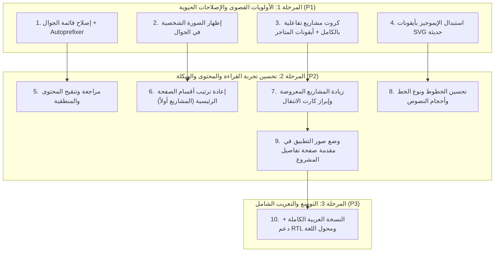

# 🚀 خطة تحسين وتطوير البورتفوليو (Portfolio Optimization Roadmap)

خطة عمل تفصيلية ومجدولة لتنفيذ تحسينات وتطويرات بورتفوليو المهندس **يونس الخالدي (Senior Flutter Developer)**، مقسمة حسب **الأهمية والأولوية** لضمان سير العمل بفعالية وجودة عالية.

---

## 📊 تصنيف المهام حسب الأولوية ومراحل التنفيذ

---

## 🔴 المستوى 1: الأولويات القصوى والوظائف الأساسية (High Priority - P1)

### 1. 📱 إصلاح قائمة الجوال (Mobile Menu) والتوافق عبر Autoprefixer
- **المشكلة الحالية:** القائمة في بعض الهواتف لا تستجيب بسلاسة، واحتمالية وجود تداخل في أحداث اللمس والـ z-index وتفاوت دعم متصفحات الهواتف (مثل iOS Safari و Android Chrome).
- **خطة العمل:**
  - تحسين أحداث النقر وإضافة دعم أحداث اللمس مع إغلاق القائمة تلقائياً عند الضغط خارجها أو على أي رابط.
  - إضافة `max-height: calc(100vh - 70px); overflow-y: auto;` لمنع اختفاء عناصر القائمة في الشاشات العريضة أفقياً أو الصغيرة.
  - تطبيق **Autoprefixer** على ملفات الـ CSS لإضافة جميع البادئات (`-webkit-`, `-moz-`) اللازمة لخصائص `backdrop-filter`, `transform`, `flexbox`, `grid`, `transition`.

---

### 2. 👤 إظهار الصورة الشخصية في وضع الجوال (Mobile Hero Profile)
- **المشكلة الحالية:** وجود كود `.hero-right { display: none; }` في شاشات الجوال يخفي الصورة الشخصية تماماً للزوار من الهواتف.
- **خطة العمل:**
  - إعادة تصميم الترويسة في الجوال لتظهر الصورة الشخصية بحجم مدروس ومتناسق (مثلاً 140px إلى 160px) مع تأثير الإضاءة الأنيق (Glow effect) وشارة الخبرة (Badge).
  - وضعها بشكل انسيابي أعلى العنوان الرئيسي أو أسفله مباشرة مع الحفاظ على التوازن البصري والسرعة.

---

### 3. 🎯 جعل كارد المشروع قابلاً للنقر بالكامل + أيقونات المتاجر الرسمية
- **المشكلة الحالية:** الانتقال لصفحة التفاصيل يتم فقط عند الضغط بدقة على زر "Read Case Study"، وأزرار المتاجر الحالية نصوص عادية لا تبرز المتجر بشكل فوري.
- **خطة العمل:**
  - جعل كامل مساحة بطاقة المشروع (Card) قابلة للنقر وتوجه مباشرة لصفحة المشروع `projects/project.html?slug=...`.
  - معالجة أزرار المتاجر الخارجية (Google Play, App Store, GitHub) بتقنية `e.stopPropagation()` لمنع تداخل الروابط.
  - إضافة أيقونات SVG رسمية وملونة لكل من: **Google Play Store**, **Apple App Store**, **GitHub** بجانب النصوص لتوضيح وجهة الزر بنظرة واحدة.

---

### 4. 🎨 استبدال الإيموجيز بأيقونات SVG احترافية (Modern Vector Icons)
- **المشكلة الحالية:** استخدام إيموجيز النصوص (📱, 🏗️, 🔌, 💳, 🚀, 🧪, 🎮, 🎓, 🏢, ⭐, 🐙, 💼, 📄, 📍, ✉️) يظهر بشكل غير موحد عبر أنظمة التشغيل المختلفة (iOS / Android / Windows) ويقلل من الطابع الاحترافي.
- **خطة العمل:**
  - استبدال كافة الإيموجيز بأيقونات متجهة SVG عالية الدقة ونظيفة ومتناسقة مع هوية الموقع ولون الـ Accent المختار.
  - تحديث: أيقونات المهارات، شارات المشاريع، وسائل التواصل في الفوتر وقسم Contact، وبطاقات الشهادات.

---

## 🟡 المستوى 2: تحسين تجربة القراءة والمحتوى والهيكلة (Medium Priority - P2)

### 5. ✍️ مراجعة وتنقيح المحتوى وإصلاح المنطقية (Content Logic Review)
- **المشكلة الحالية:**
  - دمج "DevOps & Design" في بطاقة واحدة غير متجانس.
  - وجود عبارة `9+ Apps Published` داخل قائمة المهارات (وهي إحصائية نجاح وليست مهارة برمجية).
  - الحاجة لفحص دقة العبارات التقنية وتنسيق المسميات في الخبرات والشهادات.
- **خطة العمل:**
  - إعادة هيكلة وتوزيع المهارات بشكل منطقي واحترافي:
    1. **Mobile & Core Platforms** (Flutter, Dart, Android Java, iOS).
    2. **Architecture & State Management** (Clean Architecture, Riverpod, BLoC, GetX, MVVM).
    3. **Networking & APIs** (REST APIs, Dio, Retrofit, WebSockets).
    4. **Backend & Cloud Services** (Firebase, PayTabs, Push Notifications, Local DBs).
    5. **CI/CD & Publishing** (GitHub Actions, Fastlane, Google Play Console, App Store Connect).
    6. **UI/UX & Design Tools** (Figma, Adobe XD, Responsive Design, Pixel-Perfect UI).
  - نقل إحصائيات التطبيقات المنشورة (9+ Apps Shipped) إلى شريط الإحصائيات والأرقام البارزة.

---

### 6. 📐 إعادة ترتيب أقسام الصفحة الرئيسية (Section Re-ordering)
- **الترتيب المقترح (المشاريع والإثباتات العملية في المقدمة):**
  1. **الترويسة الرئيسية (Hero Section):** التعريف المهني، الصورة الشخصية، وسرعة الوصول للسيرة والتواصل.
  2. **المشاريع المميزة (Selected Work / Shipped Projects):** رفع المشاريع مباشرة بعد الترويسة ليراها الزائر فوراً كأقوى دليل على الخبرة.
  3. **عني وأهم الأرقام (About Me & Key Highlights):** النبذة السريعة وخبرة التدريب والمحاور الأساسية.
  4. **سجل الخبرات العملية (Work Experience):** تفاصيل العمل في الشركات والمشاريع الكبرى.
  5. **المهارات والتقنيات (Skills & Expertise):** المهارات المنقحة والمنظمة.
  6. **الشهادات والتعليم (Certifications & Growth).**
  7. **قسم التواصل والتوظيف (Contact & Hire Me).**

---

### 7. 🚀 زيادة عدد المشاريع المعروضة وتوضيح كارت الانتقال لجميع التطبيقات
- **خطة العمل:**
  - رفع حد عرض المشاريع في الصفحة الرئيسية من 4 إلى (6 مشاريع أو عرض كامل الـ 9+ مشاريع المنشورة) لترك انطباع فوري بغزارة الإنتاج.
  - إعادة تصميم كارت "See All Projects / عرض كل التطبيقات" ليصبح بطاقة مميزة وجذابة بتأثير بصري تفاعلي (Glow/Gradient CTA Card) تشجع الزائر على استكشاف باقي المشاريع وصفحة `all-projects.html`.

---

### 8. 🔤 تحسين نوع الخطوط وزيادة الحجم لسهولة القراءة (Typography Upgrade)
- **المشكلة الحالية:** بعض الخطوط الحالية بحجم صغير (Small font-sizes)، وتدرجات الخطوط تحتاج تناغماً أكبر بين اللغتين الإنجليزية والعربية.
- **خطة العمل:**
  - زيادة الحجم الأساسي لخطوط النصوص (Body text) وتحسين الـ `line-height` والـ `letter-spacing` لتوفير أقصى درجات الراحة البصرية.
  - اعتماد خط عصري وواضح جداً ومثالي للبرمجة والمواقع الحديثة (مثل **Plus Jakarta Sans** أو **Inter** للإنجليزية، و **Cairo** / **Readex Pro** / **IBM Plex Sans Arabic** للعربية) مع الحفاظ على خط الـ Monospace للأكواد والتاجز.

---

### 9. 🖼️ وضع صور التطبيق في مقدمة صفحة تفاصيل المشروع (Visuals-First Case Study)
- **المشكلة الحالية:** في صفحة `projects/project.html`، الزائر يمر عبر نصوص طويلة قبل أن يصل إلى صور التطبيق والفيديو.
- **خطة العمل:**
  - إعادة ترتيب هيكل الصفحة: وضع قسم **معاينة الشاشات والنماذج التفاعلية (App Screenshots & Interactive Mockups / Video Demo)** في أعلى الصفحة مباشرة بعد الـ Hero.
  - يتبع ذلك: النظرة العامة (Overview)، الإحصائيات (Stats)، القدرات الأساسية (Capabilities)، ثم المعمارية التفصيلية والتحديات التقنية (Architecture & Technical Highlights).

---

## 🟢 المستوى 3: الميزات الكبرى والتعريب الشامل (Major Feature - P3)

### 10. 🌐 النسخة العربية الكاملة ودعم الاتجاه RTL (Full Arabic Localization)
- **المتطلبات:**
  - بناء محول لغة خفيف وسريع (Language Switcher: **EN / عربي**) في شريط التنقل العلوي وقائمة الجوال مع حفظ التفضيل في `localStorage`.
  - دعم كامل لاتجاه الصفحة `dir="rtl"` و `lang="ar"`، مع تكييف كافة هوامش التنسيق (Margins, Paddings, Flex alignment, Animations).
  - تعريب شامل ودقيق لكافة نصوص الموقع (الترويسة، النبذة، المهارات، الخبرات، الشهادات، تفاصيل المشاريع، ونموذج التواصل).
  - تطبيق خط عربي فائق الجودة والجمالية يضمن وضوح النصوص التقنية والمصطلحات البرمجية.

---

## 📋 جدول ملخص المهام وحالة التنفيذ

| رقم المهمة | اسم المهمة | الأولوية | المكونات المستهدفة | الحالة |
| :--- | :--- | :---: | :--- | :---: |
| **Task 1** | إصلاح قائمة الجوال + Autoprefixer | 🔴 P1 | `styles.css`, `script.js` | ✅ مكتملة |
| **Task 2** | إظهار الصورة الشخصية في الجوال | 🔴 P1 | `styles.css`, `index.html` | ✅ مكتملة |
| **Task 3** | كروت مشاريع تفاعلية + أيقونات المتاجر | 🔴 P1 | `js/render-projects.js`, `styles.css` | ✅ مكتملة |
| **Task 4** | استبدال الإيموجيز بأيقونات SVG | 🔴 P1 | `index.html`, `js/render-projects.js`, `projects/project.html` | ✅ مكتملة |
| **Task 5** | مراجعة وتنقيح المحتوى والمنطقية | 🟡 P2 | `index.html`, `styles.css` | ✅ مكتملة |
| **Task 6** | إعادة ترتيب أقسام الصفحة الرئيسية | 🟡 P2 | `index.html`, `script.js` | ✅ مكتملة |
| **Task 7** | زيادة المشاريع المعروضة وكارت التحويل | 🟡 P2 | `index.html`, `js/render-projects.js` | ✅ مكتملة |
| **Task 8** | تحسين الخطوط وحجم النصوص | 🟡 P2 | `styles.css`, `index.html` | ✅ مكتملة |
| **Task 9** | تقديم صور التطبيق في تفاصيل المشروع | 🟡 P2 | `projects/project.html`, `styles.css` | ✅ مكتملة |
| **Task 10** | النسخة العربية الكاملة ودعم RTL ومحول اللغة | 🟢 P3 | كافة صفحات وملفات الموقع | ⏳ جاهز للتنفيذ (المرحلة القادمة) |
